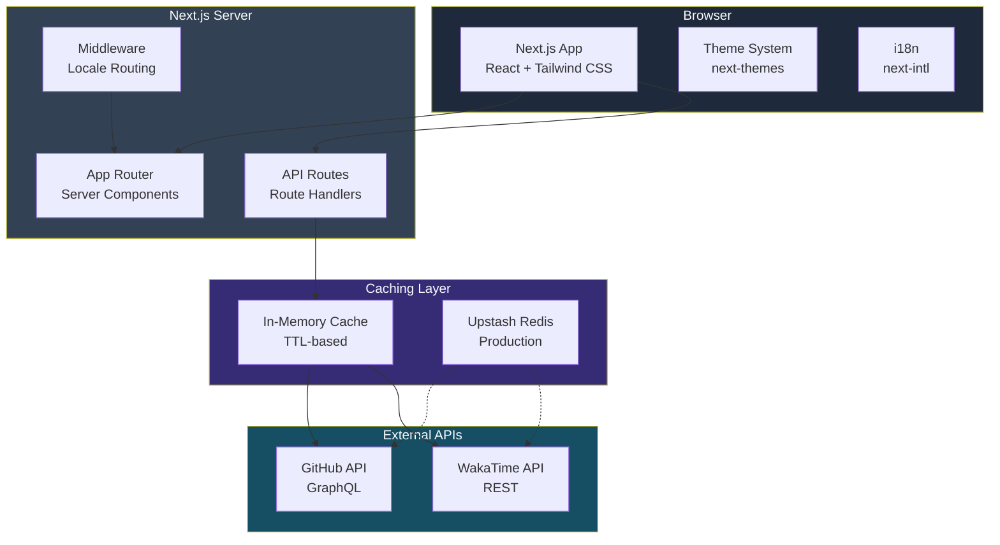

# Architecture Overview

This document describes the high-level architecture of DevPortfolio Pro.

## System Diagram

## Data Flow

1. **Page Request**: Browser → Middleware (locale detection) → Server Component → Render
2. **Dashboard Data**: Client → API Route → Cache Check → External API → Response
3. **Contact Form**: Client → API Route → Zod Validation → Rate Limit Check → Process

## Key Design Principles

- **Server-first**: Server Components by default, client only when needed
- **API Proxy**: External APIs accessed only through server-side routes
- **Graceful Degradation**: Demo data when APIs are unavailable
- **Separation of Concerns**: Components, lib, i18n, and API routes clearly separated
